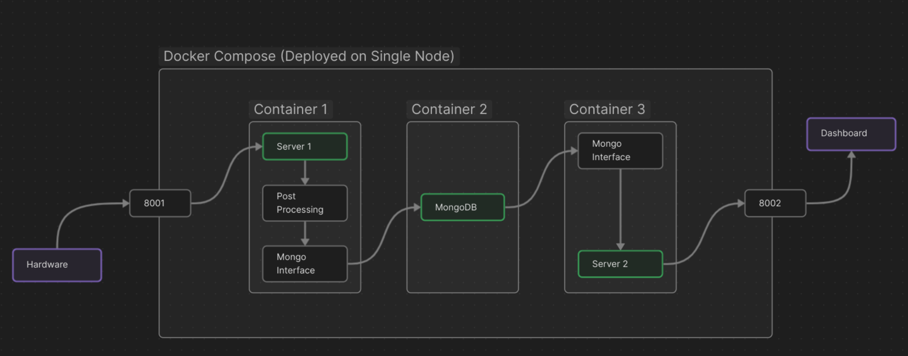

# waterquality
Machine Learning & Cloud Powered Water Quality Detection System



<div align='center'>
    <i>
        fig: Flow Diagram for the Project
    </i>
</div>

### Componenets
- [Server 1](./server-1)
- [Server 2](./server-2)
- Database (MongoDB)
- ML Model 
- [Hardware](./hardware)

### Deployment 

- **Step 1** : Install `docker` and `docker-compose`.

- **Step 2** : Clone this repo, and `cd` into local repo

    ``` bash
    git clone https://github.com/Tota-Ota/waterquality.git
    cd waterquality
    ```

- **Step 3** : Deploy with docker compose 


    ``` bash
    docker-compose up -d 
    ```